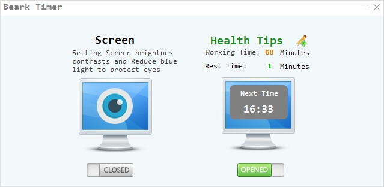

# Break-Timer
a  tool on windows  to help you reduce eyestrain from prolonged computer usage and also remind you to take breaks

### It is a well-known fact that spending a lot of time working on your computer can be bad for your health for a broad range of reasons: posture problems, bad eyesight, and other issues that appear due to a sedentary lifestyle.

### However, you can turn to third-party applications that can help you tweak your display settings and remind you to take a break every once in a while. One of these apps is Break-Timer.

## Helps you reduce your eye strain
### You can turn to Break-Timer if you want to reduce the strain your monitor is putting on your eyes by adjusting a few display-related parameters.

### After you start the application, you will notice that the "Eyes Better" option is enabled. However, the default settings might not be satisfying for your eyes, so you can click the pencil-shaped button and customize the options to your own liking. You can adjust the values of brightness, contrast and red, green or blue levels.

## Can remind you to take a break
### If you're one of those hardcore computer users that neglect their well-deserved breaks, you might want to use the "Health" function of Break-Timer, that is simply a timed reminder.
### After you enable the function, you can adjust a couple of parameters: how long your breaks should be and the interval between two consecutive breaks. After defining these settings, the application will prompt you to take a break after the set time.

## Portable tool
### Given that this application is portable, you don't need to install it on your computer. Simply unpacking the archive it comes compressed in and launching its executable lets you operate its full array of controls.

### Also, you can run it from removable drives, such as USB flash drives or external HDDs. It doesn't create additional files or folders on your PC, nor does it modify your registry entries.
